# TC001 Plus Dual Camera Interface

**Unofficial Linux implementation for TOPDON TC001 Plus thermal camera systems**

## Overview

This is the **first and only public library** for accessing TOPDON TC001 Plus dual camera systems on Linux. The manufacturer does not provide Linux support, drivers, or Python libraries.

**What this project provides:**
- **Unofficial Python implementation** for TC001 Plus dual camera access
- **Ubuntu 20+ compatibility** with full dual camera support
- **Simultaneous thermal + RGB streaming** at 25fps
- **Temperature-calibrated data** for object detection and thermal analysis
- **Open source solution** 

**Manufacturer Support Status:**
- ❌ No official Linux drivers
- ❌ No Python SDK  
- ❌ No Ubuntu support
- ❌ Windows-only software package

A Linux solution for simultaneous thermal and RGB camera access from TC001 Plus thermal camera systems.

## Example Output


*Three-window interface showing: Colorized thermal camera (left), Raw thermal data for object detection (center), and RGB camera feed (right)*

## The Problem

Linux UVC drivers have a limitation preventing multiple USB cameras from streaming simultaneously, causing "No space left on device" errors. This works fine on Windows and Android but fails on Linux due to driver architecture differences.

## The Solution

### Core Fix: Linux Kernel Module Parameter
```bash
sudo modprobe -r uvcvideo
sudo modprobe uvcvideo quirks=0x80
```

This kernel parameter tells the Linux UVC driver to handle multiple camera streams differently, allowing simultaneous access that Windows and Android handle natively.

### Technical Approach
- **FFmpeg Subprocesses**: Both cameras use FFmpeg instead of OpenCV VideoCapture to bypass V4L2 driver conflicts
- **Raw Data Streams**: Direct binary data reading from FFmpeg stdout pipes
- **Threading**: Separate capture threads for each camera to maintain 25fps performance
- **Multiple Display Windows**: Three separate OpenCV windows for different use cases

## Architecture Overview

```mermaid
graph TD
    subgraph "Hardware Layer"
        TC001[TC001 Plus Camera]
        USB[USB Controller]
        THERMAL[Thermal Sensor /dev/video6]
        RGB[RGB Camera /dev/video4]
        
        TC001 --> USB
        USB --> THERMAL
        USB --> RGB
    end
    
    subgraph "Operating Systems Comparison"
        WINDOWS[Windows: Works ✅]
        ANDROID[Android: Works ✅] 
        LINUX_ORIG[Linux Original: FAILS ❌]
        
        WINDOWS --> WIN_DRIVER[Windows USB Driver<br/>Handles Multiple Streams]
        ANDROID --> AND_DRIVER[Android USB Driver<br/>Smart Bandwidth Allocation]
        LINUX_ORIG --> UVC_ORIG[Linux UVC Driver<br/>Single Stream Limitation]
    end
    
    subgraph "Linux Problem Analysis"
        UVC_ORIG --> VIDIOC[VIDIOC_STREAMON ioctl]
        VIDIOC --> ERROR[❌ No space left on device<br/>ENOSPC/-28 Error]
        ERROR --> WHY[USB Bandwidth Conflict<br/>Driver Architecture Limitation]
    end
    
    subgraph "Our Solution"
        KERNEL_FIX[🔧 Kernel Module Fix<br/>sudo modprobe uvcvideo quirks=0x80]
        FFMPEG[FFmpeg Subprocess Approach]
        THREADING[Multi-Threading Architecture]
        
        KERNEL_FIX --> UVC_FIXED[Linux UVC Driver<br/>With Quirks Parameter]
        UVC_FIXED --> FFMPEG
        FFMPEG --> THREADING
    end
    
    subgraph "Implementation Architecture"
        FFMPEG --> THERMAL_PROC[Thermal FFmpeg Process<br/>256x384 YUYV 25fps]
        FFMPEG --> RGB_PROC[RGB FFmpeg Process<br/>640x480 MJPEG 25fps]
        
        THERMAL_PROC --> THERMAL_THREAD[Thermal Capture Thread]
        RGB_PROC --> RGB_THREAD[RGB Capture Thread]
        
        THERMAL_THREAD --> THERMAL_DATA[Raw Thermal Data<br/>Temperature Calculation]
        RGB_THREAD --> RGB_DATA[RGB Frame Data<br/>Color Conversion]
        
        THERMAL_DATA --> DISPLAY_THERMAL[Colorized Thermal Display]
        THERMAL_DATA --> DISPLAY_RAW[Raw Temperature Data]
        RGB_DATA --> DISPLAY_RGB[RGB Camera Display]
    end
    
    subgraph "Data Flow"
        DISPLAY_THERMAL --> OPENCV1[OpenCV Window 1<br/>TC001 Thermal Camera]
        DISPLAY_RAW --> OPENCV2[OpenCV Window 2<br/>TC001 Raw Thermal Data]
        DISPLAY_RGB --> OPENCV3[OpenCV Window 3<br/>TC001 RGB Camera]
        
        OPENCV1 --> OUTPUT[Three Synchronized Windows<br/>25fps Each Camera]
        OPENCV2 --> OUTPUT
        OPENCV3 --> OUTPUT
    end
    
    subgraph "Key Technical Breakthrough"
        BREAKTHROUGH[🎯 Key Insight:<br/>quirks=0x80 Parameter<br/>Changes UVC Driver Behavior]
        BREAKTHROUGH --> RESULT[✅ Both Cameras Simultaneous<br/>✅ 25fps Performance<br/>✅ Full Resolution<br/>✅ Temperature Data]
    end
    
    %% Styling
    classDef problemNode fill:#ffcccc,stroke:#ff6666,stroke-width:2px
    classDef solutionNode fill:#ccffcc,stroke:#66cc66,stroke-width:2px  
    classDef processNode fill:#cceeff,stroke:#6699ff,stroke-width:2px
    classDef successNode fill:#ccffaa,stroke:#66aa66,stroke-width:3px
    
    class ERROR,WHY,LINUX_ORIG,UVC_ORIG problemNode
    class KERNEL_FIX,UVC_FIXED,FFMPEG,THREADING solutionNode
    class THERMAL_PROC,RGB_PROC,THERMAL_THREAD,RGB_THREAD processNode
    class OUTPUT,RESULT,BREAKTHROUGH successNode
```



## Hardware Requirements

- TC001 Plus thermal camera system with dual cameras:
  - Thermal camera (typically `/dev/video6`)
  - RGB camera (typically `/dev/video4`)
- Linux system with V4L2 support
- USB 2.0+ ports

## Software Requirements

Install dependencies:
```bash
sudo apt update
sudo apt install ffmpeg v4l-utils python3-pip
pip3 install -r requirements.txt
```

## Setup Instructions

### 1. Apply Kernel Module Fix
```bash
# Temporary fix (until reboot)
sudo modprobe -r uvcvideo
sudo modprobe uvcvideo quirks=0x80
```

### 2. Make Fix Permanent
```bash
echo 'options uvcvideo quirks=0x80' | sudo tee /etc/modprobe.d/uvcvideo.conf
```

### 3. Increase USB Memory Allocation
```bash
echo 1000 | sudo tee /sys/module/usbcore/parameters/usbfs_memory_mb
```

### 4. Verify Camera Detection
```bash
v4l2-ctl --list-devices
```

Should show both cameras:
```
USB Camera: USB Camera (usb-0000:80:14.0-5.1):
    /dev/video4  # RGB Camera
    /dev/video5
USB Camera: USB Camera (usb-0000:80:14.0-5.2):
    /dev/video6  # Thermal Camera
    /dev/video7
```

## Usage

### Available Scripts

1. **`test.py`** - Dual camera interface (main script)
   - Three windows: Colorized thermal, Raw thermal data, RGB camera
   - Full temperature analysis and object detection ready data

2. **`test_thermal.py`** - Thermal camera only
   - Single thermal camera interface for testing

3. **`test_rgb.py`** - RGB camera only  
   - Single RGB camera interface for testing

### Running the Dual Camera Interface
```bash
python3 test.py
```

### Custom Device Numbers
```bash
python3 test.py <thermal_device> <rgb_device>
# Example: python3 test.py 6 4
```

### Controls
- `q` - Quit application
- `m` - Cycle through thermal colormaps
- `+/-` - Adjust blur radius
- `s/x` - Adjust temperature threshold
- `f/v` - Adjust contrast
- `h` - Toggle HUD display
- `p` - Save screenshot
- `d` - Show debug information

## Output Windows

### 1. TC001 Thermal Camera
- Colorized thermal display with temperature overlays
- Hot/cold spot detection
- Real-time temperature statistics
- Multiple colormap options (Jet, Hot, Magma, Inferno, Plasma)

### 2. TC001 Raw Thermal Data
- Grayscale temperature data for object detection algorithms
- Preserves actual temperature values
- Temperature range information
- Optimized for computer vision processing

### 3. TC001 RGB Camera  
- Standard RGB visual data
- 640x480 resolution at 25fps
- Color-corrected for OpenCV processing

## Technical Details

### Data Flow
1. **FFmpeg Subprocesses** capture raw video streams from both cameras
2. **Threading** ensures continuous 25fps data flow
3. **Thermal Processing** converts 16-bit temperature data to calibrated Celsius values
4. **RGB Processing** handles color space conversion and frame correction
5. **Display** shows three synchronized windows for comprehensive analysis

### Temperature Calculation
```python
# Convert raw thermal data to temperature
hi_data = thermal_data[..., 0].astype(np.float32)
lo_data = thermal_data[..., 1].astype(np.float32) * 256
temperature_celsius = ((hi_data + lo_data) / 64) - 273.15
```

### Why This Works
- **Kernel Quirks Parameter**: Bypasses Linux UVC driver limitations
- **FFmpeg Bypass**: Avoids OpenCV V4L2 conflicts
- **Process Isolation**: Each camera runs in separate subprocess
- **Raw Data Access**: Direct binary stream processing eliminates driver overhead

## Troubleshooting

### "No space left on device" Error
```bash
# Ensure kernel parameter is applied
lsmod | grep uvcvideo
# Re-apply if needed
sudo modprobe -r uvcvideo && sudo modprobe uvcvideo quirks=0x80
```

### Camera Not Detected
```bash
# Check USB connections
lsusb | grep -i camera
# Check device nodes
ls -la /dev/video*
```

### Low Frame Rate
```bash
# Check USB controller bandwidth
dmesg | grep -i "bandwidth\|usb"
# Try different USB ports
```

### Frame Corruption
```bash
# Reset camera formats
v4l2-ctl -d /dev/video6 --set-fmt-video=width=256,height=384,pixelformat=YUYV
v4l2-ctl -d /dev/video4 --set-fmt-video=width=640,height=480,pixelformat=MJPG
```

## Development Notes

### For Object Detection
- Use raw thermal data window for temperature-based segmentation
- RGB window provides visual context alignment
- Temperature values are calibrated and ready for thermal analysis algorithms

### Extending the Code
- Temperature thresholds can be adjusted for different detection scenarios
- Additional colormaps can be added to the `colormaps` list
- Frame processing can be modified for specific computer vision pipelines

## Performance

- **Thermal Camera**: 25fps at 256x384 resolution
- **RGB Camera**: 25fps at 640x480 resolution  
- **CPU Usage**: Moderate (FFmpeg handles video decoding efficiently)
- **Memory Usage**: ~100MB for dual camera operation

## Known Issues

- RGB camera may show left/right image split on some hardware (camera-specific firmware quirk)
- Requires root access for initial kernel module setup
- USB 1.1 controllers may have bandwidth limitations

## License & Contributing

### Open Source License
This project is released under the **MIT License** - feel free to use, modify, and distribute.

### Contributing & Bug Reports
**We need your help!** This project solves a complex Linux driver issue, but there are still improvements needed.

#### 🚨 **Priority Issue: RGB Feed Correction**
The RGB camera currently has a **left/right image split issue** where the camera's internal frame buffer doesn't align with standard expectations. This appears to be a camera-specific firmware quirk.

**Help Wanted:**
- USB packet capture analysis to understand the data format
- Camera-specific firmware documentation
- Alternative frame processing algorithms
- Hardware-specific workarounds

#### How to Contribute
1. **Fork** this repository
2. **Test** with your TC001 Plus hardware
3. **Submit Issues** for bugs and hardware compatibility
4. **Create Pull Requests** for improvements
5. **Share** your camera specifications and working configurations

#### Bug Reports
When reporting issues, please include:
```bash
# System information
uname -a
lsusb | grep -i camera
v4l2-ctl --list-devices
dmesg | tail -50

# Camera capabilities  
v4l2-ctl -d /dev/video4 --list-formats-ext
v4l2-ctl -d /dev/video6 --list-formats-ext
```

#### Feature Requests
- Additional camera models support
- Performance optimizations
- Object detection integration examples
- Alternative RGB processing methods
- Cross-platform compatibility

#### Community
- **Report bugs**: GitHub Issues
- **Share improvements**: Pull Requests  
- **Hardware compatibility**: Wiki documentation
- **RGB feed fixes**: Special bounty consideration


Every contribution helps make this solution work better across different hardware configurations!
